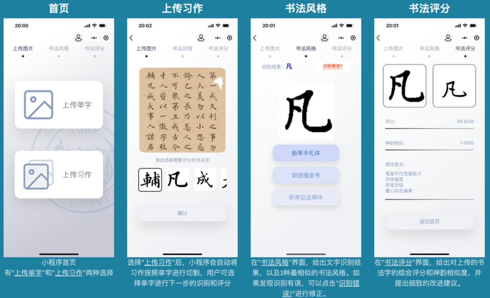
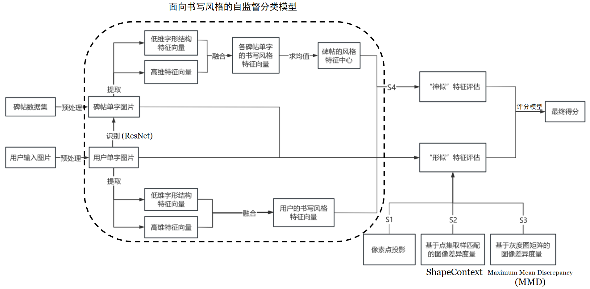
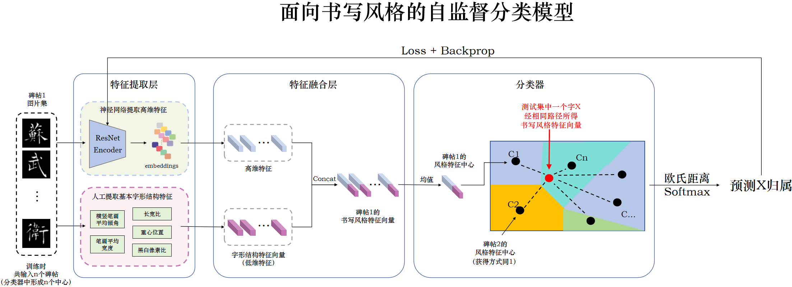

# 👋 Welcome!

2023 国创项目《“形神兼备”的楷书辅助评分系统》结题成果，一个 “形神兼备” 的智能书法评分小程序！项目旨在运用深度学习的方法解析书法字结构和风格中的高低维特征，即把字体重心、笔画宽度等低维“形似”特征与神经网络捕捉到的高维“神似”特征相结合，将书法字的“形”“神”特征量化为可评估指标。后由校创项目《面向书写风格的汉字识别系统》接手进一步完善，背景介绍：[https://ihanzi.net/content/images/score/](https://ihanzi.net/content/images/score/)

# 🔧 工作流程

# 👨‍💻 自监督分类模型

受原型网络启发搭建，“神似”可以抽象为“与对应风格相似程度”的问题。中国书法风格千变万化，不同的书法风格、同一种风格的不同书法家、甚至同一个书法家写下的字都有区别，然而传统的分类方法通常是 “闭集识别”，对数据集之外的风格识别不准，而且若要向数据集中添加新风格，则往往需要重新训练整个分类模型，但是以原型网络为代表的零样本学习方式就可以很好地解决这个问题。它以聚类思想为核心，学到的是提取特征的方式，只要通过一定数量的风格数据集做出预训练模型，那么任给一个风格书法字数据集，都可以在潜空间中聚类出一个中心点，于是“判断风格相似程度”就变为“在潜空间的所有风格类中距离某个风格中心点的远近”

# 💡 文件配置

### 前端

使用 typescript 编写，直接把整个仓库的代码用微信开发者工具打开即可

### 后端

`backend/` 文件夹下，`requirements.txt` 为所用依赖。使用 flask 框架开放 9999 端口，接口全部封装在 `main.py` 文件中，执行指令 `python main.py` 即可启动。原型网络和ResNet识别网络会需要一些算力，因此其实是单独分出来部署在校内 GPU 服务器上让信息办开了个公网访问端口，这里也放进来了，一个是`recognize.py`，一个是`protonet`，剩余的其他文件都是通过 `main.py` 囊括部署在阿里云 ECS 上。至于微信小程序发布需要 HTTPS，在阿里云ECS上做了一个 nginx 转发。由于 Github 限制 100MB，只上传了一个 demo 书法风格。

# 🥰 Have a Try!

